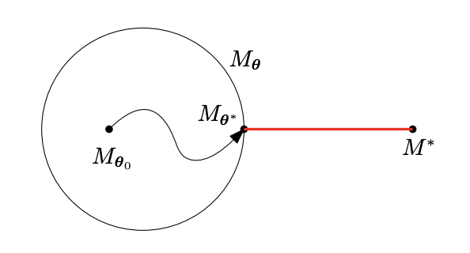
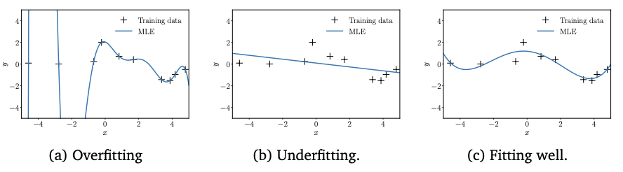
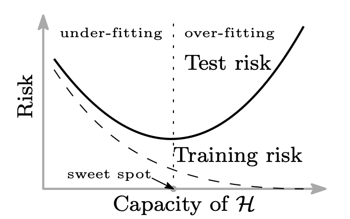
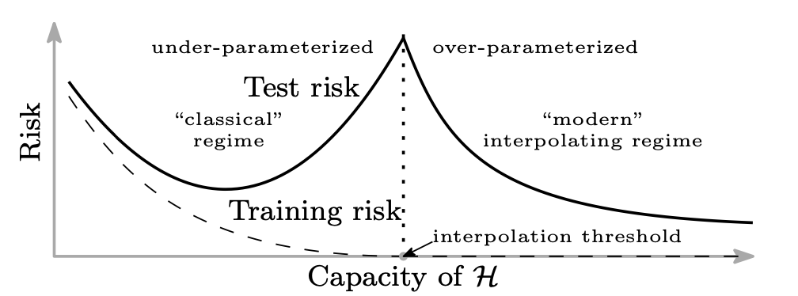
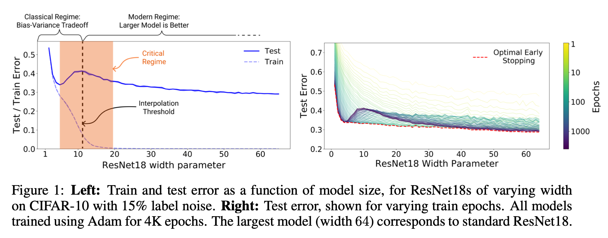
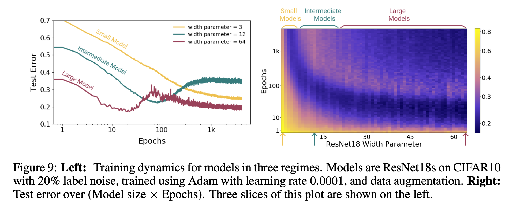
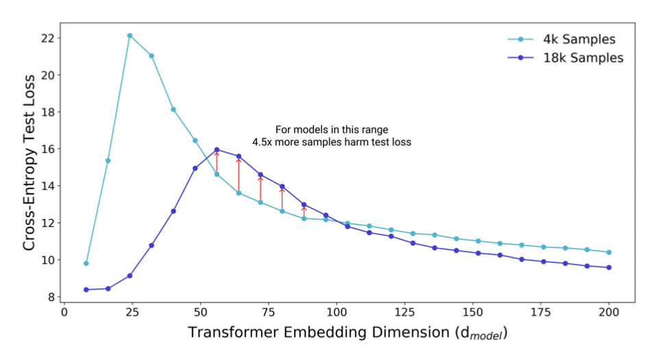
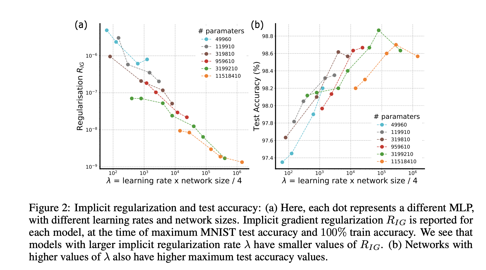

# Why are over-parameterized networks able to generalize?

In recent years we have seen an explosion in the number of model parameters in state of the art DL approaches. While [AlexNet](https://papers.nips.cc/paper/2012/file/c399862d3b9d6b76c8436e924a68c45b-Paper.pdf) in 2012 has ~60 million parameters, more recent models like a GPT-3 have a count of 175 billion parameters and there is a common intuition that larger models are generally better at generalizing. This intuition, however, is at odds with a "classical" statistical understanding of approximating a distribution using a finite amount of (noisy) samples. From the latter one would expect that increasing the parameter count of a model beyond a certain point will hurt generalization. 

So,
* Does ML and DL in particular indeed render the conventional view as outdated?
* How do we systematically study this alleged behaviour?
* What are the mechanisms which could give raise to this observation?

# Bias and Variance
The goal of machine learning or statistical learning theory is to approximate an unknown distribution $M^*$ using a finite set of training data sampled from $M^*$. Different approaches usually differ in the choice of the function space $M_{\theta}$ one uses to search for a candidate model and how one defines the distance measure which determines what is considered a good fit.
||
|:--:| 
| *Schematic illustration of a situation where the function space is not expressive enough to model the true distribution $M^*$. The closest approximation $M^*_{\theta}$ is found via optimization methods starting at some initial choice of model parameters $M_{\theta_0}$. [Source](https://mml-book.github.io/)* |

The "textbook" understanding is that the complexity of the model used to approximate the true distribution needs to be "just right". If there are too few free parameters in the model, no matter how you tune the parameters, the predictive power of the model will be too limited i.e we are under-fitting. On the other end, if there are too many parameters, we are able to perfectly fit every sample in the training data at the cost of generalization as we are also fitting noise i.e. we are over-fitting. Note furthermore, that in the latter case there is not a unique solution and there are many possible ways to fit the training data perfectly. 
The following figure illustrates these different scenarios using n-degree polynomials as $M_{\theta}$ 
||
|:--:|
|*[Source](https://mml-book.github.io/)*|

These three regimes are summarised in more general way in the following figure

||
|:--:|
|Schematic depiction of how the loss on training and test set scales as a function of model complexity ($\mathcal{H}$ here corresponds to $M_{\theta}$ above). The the "sweet spot" depicts the point where the model complexity is "just right". Before this point an increase of the model complexity goes along with a decrease on train error *and* test error. After the "sweet spot", the model starts to learn the training data "by heart" at the cost of generalization which is reflected by an increase of the error on the test set.  *[Source](https://arxiv.org/abs/1812.11118)*|

Given this conventional understanding of how model complexity is expected to influence generalizability, how is the success of modern deep learning architectures, which are often over-parameterized (i.e. number of training samples $\ll$ number of weights) to be understood?

> **Use of the term "Classical"** Note that we the fact that deep learning seems to go beyond this classical schematic doesn't imply that 'classical' statistics is wrong in some sense (what would that even mean?), but rather that modern machine learning has some additional structure and mechanisms which limit the applicability of the classical view.

# Double-descent phenomenon
In [Belkin et al. (2018)](https://arxiv.org/abs/1812.11118) the authors study the above discussed phenomenon systematically using primarily Kernel-based methods ([Random Fourier Features](https://gregorygundersen.com/blog/2019/12/23/random-fourier-features/) in particular) and they propose an extension of the classical picture to an *over-parameterized* regime

||
|:--:|
|Extension of classical bias-variance picture to a "modern" over-parameterized regime. The interpolation threshold corresponds to the point where the model complexity matches the number of training samples. *[Source](https://arxiv.org/abs/1812.11118)*|

With this picture, the loss on the test set peaks at the "interpolation threshold" and then monotonically decreases. The interpolation threshold corresponds to the point where the number of model parameters matches the number of training samples (or for classification: number of training samples $\times$ number of classes). This is the first time where the model complexity of $\mathcal{H}$ is large enough to perfectly fit all the training samples (hence "interpolation").
Most importantly the loss beyond the interpolation threshold reaches values *lower* than the minimum in the classical picture.

The double-descent phenomenon is studied in more generality in [Nakkiran et al. (2019)](https://arxiv.org/abs/1912.02292). In particular they introduce a more general notion of model complexity which goes beyond just the number of free parameters.

>We define the **effective model complexity (EMC)** of a training procedure as the maximum number of samples on which it can achieve close to zero training error. The EMC depends not just on the data distribution and the architecture of the classifier but also on the training procedure—and in particular increasing training time will increase the EMC.

With this notion of complexity, we expect to see a double-descent phenomenon along the dimension of model complexity as in number of parameters but also along the dimension of training time.

||
|:--:|
|Experimental observation of the double descent phenomenon using CIFAR-10 on ResNet18 with varying width. The critical regime (orange) denotes a kind of 'potential barrier': If you find yourself in the minimum of the test error in the classical regime, increasing the number of parameters of your model will hurt your generalization performance while you are in this region. Furthermore, note that early stopping only makes sense for a given range of width values. *[Source](https://arxiv.org/abs/1912.02292)*|

||
|:--:|
|Experimental observation of the double descent phenomenon along the training time dimension *[Source](https://arxiv.org/abs/1912.02292)*|

Note that a corollary of the observed EMC scaling behaviour is that in certain regimes adding more data actually **hurts** your generalization performance! To see this, remember that EMC is defined as the number of training samples which can be exactly fitted. If we increase the number of training samples we consequently shift the interpolation threshold to the right, which will in some cases mean worse test error compared to a curve corresponding to a smaller train set.

||
|:--:|
|Two different test loss as a function of embedding dimension (which corresponds to model complexity as in number of parameters) on a transformer model. The two curves differ in the number of training samples and illustrate a surprising case where increase training set size leads to worse test performance*[Source](https://arxiv.org/abs/1912.02292)*|

While we now have seen ample evidence that indeed over-parameterized networks are able to reach better test errors, the question of *why* and *how* this is possible still remains. One intuition shared by both of the authors above is that since the interpolation threshold is the first point where we have enough complexity to perfectly fit the training data, going beyond this point will we be able to select from a wide variety of models which are able to perfectly fit the training data but also be a better approximation to the true distribution $M^*$. This raises two other questions though:
* Given a set of models which fit the training set perfectly, in what sense can one to be expected to generalize better than the other?
* What is the driving force or incentive during training to select such a solution as this selection starts to happen once the training error has *already* reached zero and remains there?

One plausible explication is that common training procedures implicitly harbour a type of bias or regularization mechanism which seek out those solutions in the loss landscape which generalize better. This 

# Implicit regularization
In [Barrett, Dherin (2020)](https://arxiv.org/abs/2009.11162) they argue that stochastic gradient descent has a hidden regularization mechanism. Their argument is roughly:
1. Gradient descent iterations have a finite step size/learning rate and thus one does not follow the actual gradient flow but an effective one "overshooting" at every iteration step.
2. What is the loss function of which the actual gradient flow corresponds to this effective flow?
3. They show that the gradient corresponds to a loss which is the original loss $E(\theta)$ with a correction term *proportional to gradient of the loss* 
$$
E_{eff}(\theta) = E(\theta) + \lambda E_{corr}(\theta)
$$ 
with $E_{corr}(\theta) = {\frac{1}{m}\sum_{i}^{m}(\nabla_{\theta_i}E(\theta))^2}$ and $\lambda = \frac{hm}{4}$ where $h$ is the step size and $m$ the number of parameters.

This means that gradient descent actually seeks out solutions in flatter regions of the loss landscape as local minima in hilly regions have a higher loss due to the correction term. This might explain why networks initialized totally differently converge to similar solutions. They then argue that this is the reason why gradient descent seeks out more generalizable solutions because flatter minimas are apparently known empirically to have better generalization properties as suggested by the following measurements
||
|:--:|
|In the left figure we see the different values for $E_{corr}$ as a function of $\lambda$ and on the right figure we see the corresponding test accuracy for the different models. Lower values of $E_{corr}$ (and thus flatter minimas) are found to correlate with better accuracy on the test score*[Source](https://arxiv.org/abs/2009.11162)*|

What is the relationship between the geometry of a given minimum and the generalizability of the associated solution though? 
One common principle which is often evoked is that of Occam Razor, the philosophical idea that if multiple models describe the same phenomenon, then one should pick the one which is simpler. What do we mean with "simpler" though? From the discussion so far, the number of parameters does not seem to be the right way to define simplicity as otherwise we would expect the model at the interpolation threshold to generalize best. In the case of [Belkin et al. (2018)](https://arxiv.org/abs/1812.11118), where they first illustrated the exitence of the double-descent phenomenon using Kernel methods, "simpler" means a lower norm on the sum of parameter values $\min_{M_{\theta^*}\in M_\theta} \sum_i\|{\theta_i}\|$.