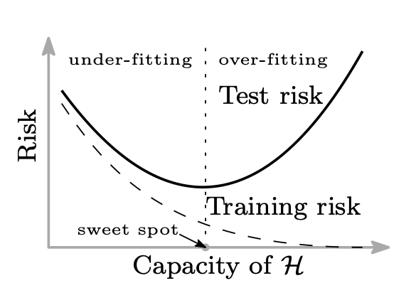
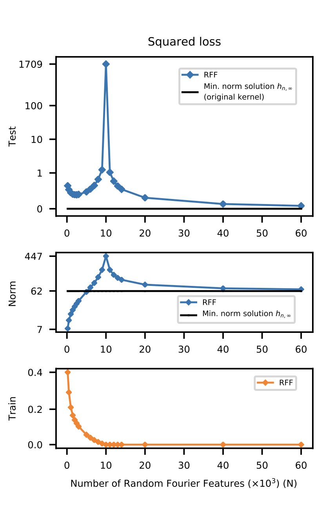
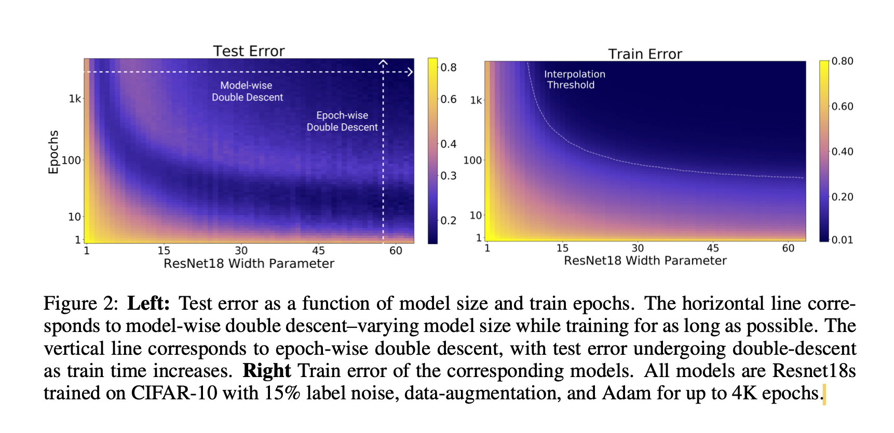
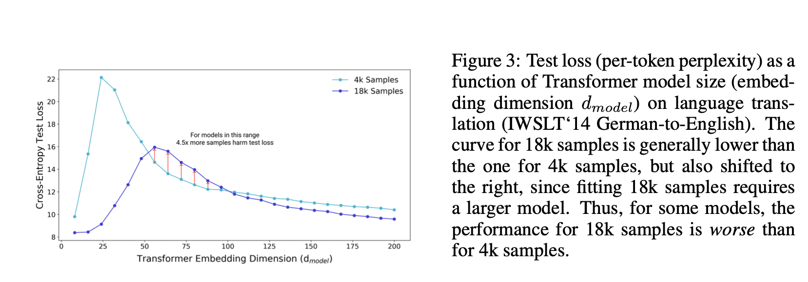

# Why are neural networks able to generalize?
* while deep learning made in the last ten years there are still some open major questions around the theoretical foundations. 
* We need to take a "computational science" approach to study emerging properties from complex systems by simulating them
## Setup
* In general machine learning the search for an "optimal" predictor within a class of models $\mathcal{H}$ is done via some optmization method
* The "size" of $\mathcal{H}$ is considered key to find a good model. To small and the model is expected to underfit and too large and the model will fit the training data perfreclty while generalize poorly

* In deeplearing we deal with very large, over-parameterized models (#free parameters >> data points), however, even though they can fit the  training data at a near zero loss, such solutions seem to also generalize well to unseen data which is not what would be expect from conventional wisdom
* This paper explores the question of how this is possible and what the underlying mechanics are which give raise to this phenomenon

## Result
* They find that modern machine learning exhibit an additional regime beyond the standard U curve and call it double descent

The interpolation threshold occurs at $N \approx n*k$ where $N$ denotes the number of model parameters, $n$ the number of traninig samples and $k$ the number of classes in a classification task.
* In the "modern" regime the search space includeds a lot of solutions to fit the training set perfectly, nonetheless we find that models in this regime are able to generalize reasonably well while maintiaing low loss on the training data
* They argue that this happens due to some implicit regularization, in particular that optimization in high parameter regime seeks out solutions with low $l2$ on the weights (see below figure).
* "*For the classes HN that we consider, there is no guarantee that the most regular, smallest norm predictor consistent with training data (namely hn,∞, which is in H∞) is contained in the class HN for any finite N. But increasing N allows us to construct progressively better approximations to that smallest norm function. Thus we expect to have learned predictors with largest norm at the interpolation threshold and for the norm of hn,N to decrease monotonically as N increases thus explaining the second descent segment of the curve.*"

# Questions
* Why do lower norm solutions generalize better? I.e. What is the mathematical version of Okhams razor
* How exactly does this seeking of lower norm solutions happen, why dont we see ourselves stuck in random local minima?

The above observation has been generalized across tasks, models and optimization procedures [here](https://arxiv.org/pdf/1912.02292.pdf). They define an effective model complexity as the maximum number of training samples that can be fitted to near-zero loss. They are able to also show a double-descent behaviour while keeping model complexity fixed and increasing training time

Note that the effective model complexity reduces when we introduce more traiing samples. This means that in certain scenarios the introduction of addtional training samples acctually degrades the performance for a given model as the interpolation threshhold (effective model complexity $\approx$ number of samples) is shifted to the right

What gives rise to this phenomenon though? One possible intution is that at the interpolation threshold we only have one model which is able to fit the training model perfectly while beyond the interpolation threshold there is room to select from a lot of models which fit the training perfectly while still conserving global features which are necessary for generalization to unseen data. How are these specific solutions seeked out though as all of them should have the same emperical risk i.e. loss on the training set?

One way of answering is that SGD has an implicit regularization term. In https://arxiv.org/abs/2009.11162 they show that in fact due to the discrete steps taken in gradient descent, the actual gradient which is being followed is the one of the loss + a term which is quadratically dependent on the gradient of the loss. So what happens is that besides minimizing the loss we also seek out flat regions of the loss landscape. "Empirically" it is known that these regions generalize better. Furthermore, as flat regions are robust to pertubations, this might also explain why networks which are initalized differently converge more or less to a similair loss.

